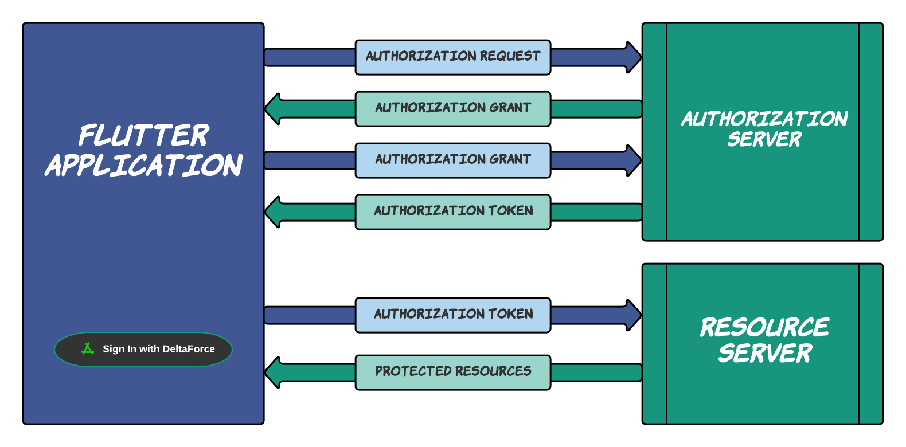

<!-- 
This README describes the package. If you publish this package to pub.dev,
this README's contents appear on the landing page for your package.

For information about how to write a good package README, see the guide for
[writing package pages](https://dart.dev/guides/libraries/writing-package-pages). 

For general information about developing packages, see the Dart guide for
[creating packages](https://dart.dev/guides/libraries/create-library-packages)
and the Flutter guide for
[developing packages and plugins](https://flutter.dev/developing-packages). 
-->

A flutter package for authentication with [DAuth](https://auth.delta.nitt.edu)(an OAuth2 based SSO (Single Sign On) for NITT students) authorisations service on behalf of the resource-owner/user.
DAuth lets the application developers securely get access to users’ data without users having to share their passwords.

DAuth allows a Client-App (the program using this library) to access and manipulate a resource that's owned by a resource owner (the end user) and lives on a remote server. The Client-App directs the resource owner to dauth authorization server, where the resource owner tells the authorization server to give the Client-App an access token. This token serves as proof that the client has permission to access resources on behalf of the resource owner.

Note: OAuth2 provides several different methods for the client to obtain authorization.But, currently This package  only supports Authorisation Code Grant

## Features


* This Package Allows user to get the authorized token by calling ```fetchTokenViaWebView(authorizationRequest)```, which automates the following workflow:
    * Generates ``authorizationUrl`` using the provided authorizationRequest in the parameter.
    * Opens up a webView with the generated ``authorizationUrl`` and Listens to the NavigationRequests.
    * Allows user to enable permissions to Client-App to access the resource of the user from Dauth-Resource-Provider.
    * After Authentication server redirects to the registered `redirect_uri` and ``code`` is fetched by listening to the NavigationRequest.
    * Using the code as body parameter a post-request is automated to retrive the token.
* Once the `tokenResponse` is fetched the user can send a post request using ``fetchResources(token)``  and get the protectedResources based on the *Scope* mentioned.

 ### DataTypes
  DataTypes                  |   Parameters                                              |   Description
---------------------------- | -------------                                             |--------------------------
*ResultResponse<<T,String>>* | *dynamic* response,*String* message                       |   Wraps Http response-body with response-status-message.
*ResourceResponse*           |  *String?* tokenType, *String?* accessToken, *String?* state, *int?* expiresIn,*String?* idToken,*String?* status,*ErrorResponse?* errorResponse|   Response-body returned from `fetchResources()` request
*TokenResponse*|  *String?* email,*String?* id,*String?* name,*String?*  phoneNumber,*String?* gender,*DateTime?* createdAt,*DateTime?* updatedAt,             |                                                            Response-body returned from `fetchToken()` request
*Scope*                      | *bool* isOpenId, *bool* isEmail, *bool* isProfile, *bool* isUser                                      |   Consists of 4 boolean parameters to enable SCOPE of Resource Access
*AuthorizationGrantRequest* | *String?* clientId,*String?* clientSecret,*String?* redirectUri,*String?* responseType,*String?* grantType,*String?* state,*String?* scope,*String?* nonce | Request-Parameter for `fetchTokenViaWebView()`

 ### Methods

  Methods                                                         |   Parameters 
----------------------------------------------------------------- | --------------------------
*ResultResponse<<TokenResponse,String>>* `fetchTokenViaWebView()` | *AuthorizationGrantRequest* `request`
*ResultResponse<<ResourceResponse,String>>* `fetchResource()`     | *String* `access_token`
*Widget* `DauthButton()`                                          | *Function* OnPressed: (Response<TokenResponse,String> res){}

## Getting started
To use this package:
* Run the following command in terminal
  * ```
    flutter pub get flutter_dauth
    ```
    OR
* Add the following in pubspec.yaml file
  * ```yml
    dependencies:
        flutter:
            sdk: flutter
        flutter_dauth:   
     ```
## Usage

Following is an example of Authorization Grant Code using this package. 

```dart
void main() {
  runApp(const MyApp());
}

class MyApp extends StatelessWidget {
  const MyApp({Key? key}) : super(key: key);

  @override
  Widget build(BuildContext context) => const MaterialApp(
        debugShowCheckedModeBanner: false,
        home: HomePage(),
      );
}

class HomePage extends StatefulWidget {
  const HomePage({Key? key}) : super(key: key);
  @override
  State<StatefulWidget> createState() => HomeState();
}

class HomeState extends State<HomePage> {
  final String _exampleText = 'Flutter Application';
  final AuthorizationGrantRequest _authorizationGrantRequest =
      AuthorizationGrantRequest(
          clientId: 'YOUR CLIENT ID',
          clientSecret: 'YOUR CLIENT SECRET',
          redirectUri: 'YOUR REDIRECT URI',
          state: 'STATE');

  @override
  Widget build(BuildContext context) => SafeArea(
          child: Scaffold(
              body: Container(
        color: Colors.blueGrey,
        child: Stack(
          children: [
            Center(
                child: Text(
              _exampleText,
              style: const TextStyle(fontSize: 35, fontWeight: FontWeight.bold),
            )),
            Positioned(
                left: 50,
                right: 50,
                bottom: 10,
                child: DauthButton(
                    request: _authorizationGrantRequest,
                    onPressed: (ResultResponse<TokenResponse, String> res) {
                      setState(() => (res.response as TokenResponse)
                          .accessToken
                          .toString());
                    }))
          ],
        ),
      )));
}
```
## Issues
* This Package is Not preffered for Flutter-Web since it currently supports Authorization Grant Code at the time of writing.
## Credits

This package wouldn't be possible without the following:
* [webviewx](https://pub.dev/packages/webviewx) : for opening AuthorizationUrl in WebView and Listening to NavigationRequest
* [https](https://pub.dev/packages/http) : for HTTP requests to the Dauth-Server.
